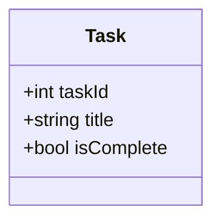
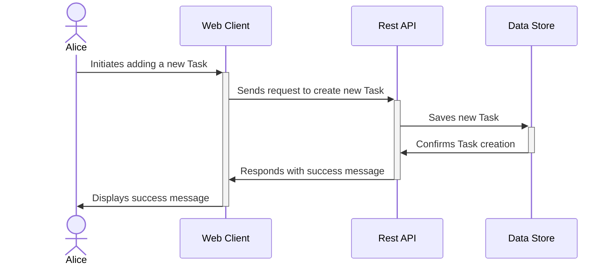
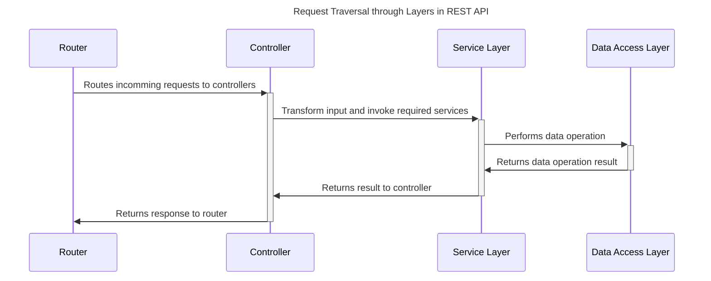

# Distributed Systems - RESTful APIs

A codelab for implementing a Web API using the RESTful interface pattern.
The training examples here comes with setup for either a JavaScript API through ExpressJS or a C# Minimal Web API through ASP.NET Core.

## Prerequisites

- [Container Runtime (Docker Desktop)](https://docs.docker.com/desktop/)
- [VS Code Extension Dev Containers](https://marketplace.visualstudio.com/items?itemName=ms-vscode-remote.remote-containers)

## Start Project

1. Clone Repository

   ```sh
   git clone https://github.com/LarsGJobloop/distributed-systems-restful-apis
   ```

2. Open the repository using the provided devcontainer, [Devcontainer quick start](https://code.visualstudio.com/docs/devcontainers/containers#_quick-start-open-an-existing-folder-in-a-container).<br>**_Requires_** [Docker](https://docs.docker.com/desktop/) installed.

   b. Alternativly you could install **both** [NodeJS](https://nodejs.org/en) and the whole [C# toolchain](https://devblogs.microsoft.com/dotnet/the-net-native-tool-chain/) on your system (it's a pain, especially whenever you need to update to a new version or onboard a new member on your team).

3. Start one of the projects

   <details>
   <summary>Node HTTP Server</summary>

   1. `cd apis/node-web-server`
   2. `npm run start`
   </details>

   <details>
   <summary>Node Express Server</summary>

   1. `cd apis/express-rest-api`
   2. `npm run start`
   </details>

   <details>
   <summary>C# Minimal API</summary>

   1. `cd apis/csharp-rest-api`
   2. `dotnet run`
   </details>

## Architecture

### Version 1.0 of the task model



### Sequeence for adding a new task


### Layered Architecture for REST APIs

A specific pattern for creating REST APIs which allows easy changing different parts of the application as the system evolves.

[Short description of a Layered API architecture](https://chat.openai.com/share/755593e0-92a6-495b-8ad5-79f2341b519f)



## Links

- [HTTP Message](https://developer.mozilla.org/en-US/docs/Web/HTTP/Messages)
- [REST API](https://en.wikipedia.org/wiki/REST)
- [Open API](https://www.openapis.org/)
- [Schemas and LLMs](https://chat.openai.com/share/5ccea232-f1c3-432a-a77a-b1ff000f0fa0)
- [Node Express](https://expressjs.com/)
- [Layered API Architecture for Node Express](https://www.freecodecamp.org/news/rest-api-design-best-practices-build-a-rest-api/)
- [C# ASP.NET Core Minimal API](https://learn.microsoft.com/en-us/aspnet/core/fundamentals/minimal-apis?view=aspnetcore-8.0)