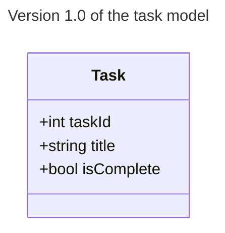
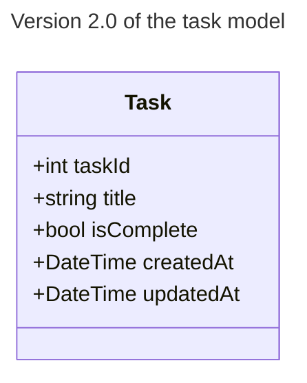
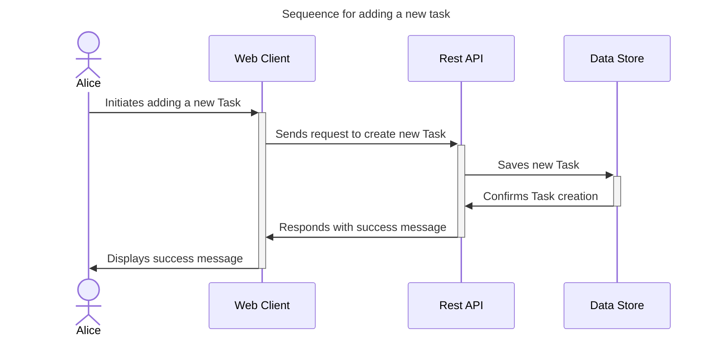
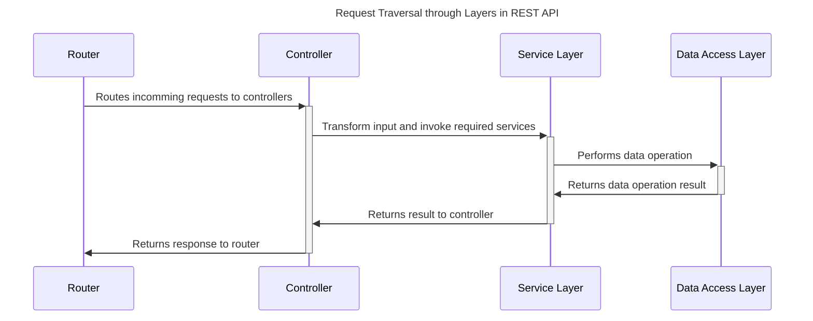

# Distributed Systems - RESTful APIs

A codelab for implementing a Web API using the RESTful interface pattern.
The training examples here comes with setup for either a JavaScript API through ExpressJs or a C# Minimal Web API through ASP.NET Core.

## Prerequisites

- [Container Runtime (Docker Desktop)](https://docs.docker.com/desktop/)
- [VS Code Extension Dev Containers](https://marketplace.visualstudio.com/items?itemName=ms-vscode-remote.remote-containers)

## Start Project

1. Clone Repository

   ```sh
   git clone <git-repository-url>
   ```

2. Open folder in VS Code

   ```sh
   cd <project-name>
   code .
   ```

3. Start Services

   ```sh
   docker compose up
   ```

## Architecture







[Short description of a Layered API architecture](https://chat.openai.com/share/755593e0-92a6-495b-8ad5-79f2341b519f)



## Links

- [HTTP Message](https://developer.mozilla.org/en-US/docs/Web/HTTP/Messages)
- [REST API](https://en.wikipedia.org/wiki/REST)
- [Open API](https://www.openapis.org/)
- [Node Express](https://expressjs.com/)
- [Layered API Architecture for Node Express](https://www.freecodecamp.org/news/rest-api-design-best-practices-build-a-rest-api/)
- [C# ASP.NET Core Minimal API](https://learn.microsoft.com/en-us/aspnet/core/fundamentals/minimal-apis?view=aspnetcore-8.0)